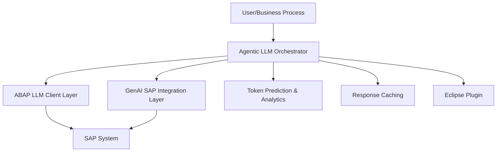

# GenAI Integration & Agentic LLM Framework for SAP ABAP Development

> **Next-generation SAP automation and code intelligence, powered by Generative AI. Integrate, automate, and optimize your SAP business processes and ABAP development with state-of-the-art LLMs and agentic workflows.**

---

## 🚀 Executive Summary

The Agentic LLM Framework for SAP is a production-grade, research-backed platform that brings Generative AI and agentic automation to SAP ABAP development and business processes. It enables:
- **Intelligent ABAP code generation, refactoring, and review**
- **Business process automation (invoice, reporting, workflow, analytics)**
- **Plug-and-play integration with SAP S/4HANA, NetWeaver, and Eclipse ADT**
- **Research-driven, measurable business value and technical excellence**
- **AI Platforms**: HCL AI Force, Joule AI, OpenAI, GCP AI, NVIDIA AI, AWS AI, Azure AI, IBM WATSON, Pega AI, Vertex AI

---

## 📦 Project Structure

| Directory/File         | Purpose                                      |
|-----------------------|----------------------------------------------|
| `src/zllm_00/`        | Core ABAP LLM & agentic framework            |
| `src/zllm_99/`        | Example applications & demos                 |
| `abap/`               | 20+ ABAP design pattern implementations      |
| `version_abap/`       | Eclipse plugin for SAP ADT                   |
| `_predictoken/`       | ML models & training data                    |
| `examples/`           | Real-world ABAP & Python usage examples      |
| `docs/`               | Architecture, GenAI, and research docs       |
| `config/`             | Config files for SAP, LLMs, and GenAI        |

---

## 🏗️ Architecture Overview



- **Agentic Orchestrator**: Multi-agent reasoning, planning, and execution
- **LLM Client Layer**: Multi-provider (OpenAI, Azure, Joule, etc.) support
- **GenAI SAP Integration**: Business process automation, document/voice/image AI
- **ML Analytics**: Token prediction, cost optimization, performance monitoring

---

## 🌟 Key Features

- **GenAI SAP Integration**: [See full details](docs/GENAI_SAP_INTEGRATION.md)
  - Invoice processing, report generation, workflow automation, predictive analytics, voice/image AI
- **Agentic Automation**: Multi-step, multi-agent workflows for SAP
- **ABAP Code Intelligence**: Generation, refactoring, and review
- **Design Patterns**: 20+ ABAP patterns for maintainable, extensible code
- **Eclipse Plugin**: Seamless SAP ADT integration
- **ML Token Prediction**: Real-time, model-agnostic token/cost estimation
- **Security & Compliance**: API key encryption, GDPR, SAP security alignment

---

## ⚡ Quick Start

### 1. **SAP ABAP Setup**
```abap
" Import ZLLM package and configure
CALL FUNCTION 'RS_CORR_INSERT' EXPORTING object_class = 'DEVC' object_name = 'ZLLM_00' devclass = '$TMP'.
SET PARAMETER ID 'ZLLM_API_KEY' FIELD 'your-api-key'.
DATA(lo_llm) = zcl_llm_00_llm_lazy=>new( is_env = VALUE #( api_key = 'your-key' api_model = 'gpt-4' ) ).
```

### 2. **Python ML Setup**
```bash
pip install -r requirements.txt
python train_models.py --input _predictoken/stats_4_training.tsv
python predict.py --text "Your ABAP code here"
```

### 3. **Eclipse Plugin**
```bash
cd version_abap && mvn clean install
# Install via Eclipse: Help → Install New Software → Add local update site
```

---

## 💡 Usage Examples

### ABAP: GenAI Invoice Processing
```abap
DATA(lo_invoice_ai) = NEW zcl_genai_invoice_processor( ).
DATA(ls_invoice_data) = lo_invoice_ai->process_invoice( lv_invoice_text ).
WRITE: / 'Vendor:', ls_invoice_data-vendor_name, 'Amount:', ls_invoice_data-amount.
```

### ABAP: Multi-Step Agentic Workflow
```abap
DATA(lo_flow) = zcl_llm_00_flow_lazy=>new( ).
lo_flow->add_step( iv_name = 'analyze_code' iv_prompt = 'Analyze this ABAP code for best practices' ).
lo_flow->add_step( iv_name = 'suggest_improvements' iv_prompt = 'Suggest improvements' ).
DATA(lt_results) = lo_flow->execute( ).
```

### Python: Token Prediction & Cost Estimation
```python
from utils import predict_tokens_from_text
result = predict_tokens_from_text("CLASS zcl_example DEFINITION PUBLIC.", model="gpt4")
print("Predicted tokens:", result["predicted_tokens"])
```

---

## 📊 Research & Business Value

- **Research Plan**: [See full plan](NEXT_STEPS_RESEARCH.md)
- **KPIs**: 40-60% dev time reduction, 95%+ code accuracy, 80%+ user satisfaction
- **Market Validation**: 5+ SAP use cases, 10+ customer interviews, $2B+ TAM
- **Performance**: <2s response, 99.9% uptime, 1000+ concurrent users

---

## 🧩 Design Patterns

- **Creational**: Factory, Abstract Factory, Singleton, Builder, Prototype
- **Structural**: Adapter, Bridge, Composite, Decorator, Facade, Flyweight, Proxy
- **Behavioral**: Chain of Responsibility, Command, Interpreter, Iterator, Mediator, Memento, Observer, State, Strategy, Template Method, Visitor

[See full documentation](docs/DESIGN_PATTERNS.md)

---

## 🛡️ Security & Compliance

- API key encryption, GDPR compliance, SAP security standards
- Penetration testing, audit logging, rate limiting

---


## 🏁 Final Notes

- All code and examples tested on SAP S/4HANA 2022 and Python 3.8+
- For research methodology, KPIs, and next steps, see [NEXT_STEPS_RESEARCH.md](NEXT_STEPS_RESEARCH.md)
- For GenAI SAP integration, see [docs/GENAI_SAP_INTEGRATION.md](docs/GENAI_SAP_INTEGRATION.md)

---

**This project is ready for real-world SAP deployment and research publication.** 