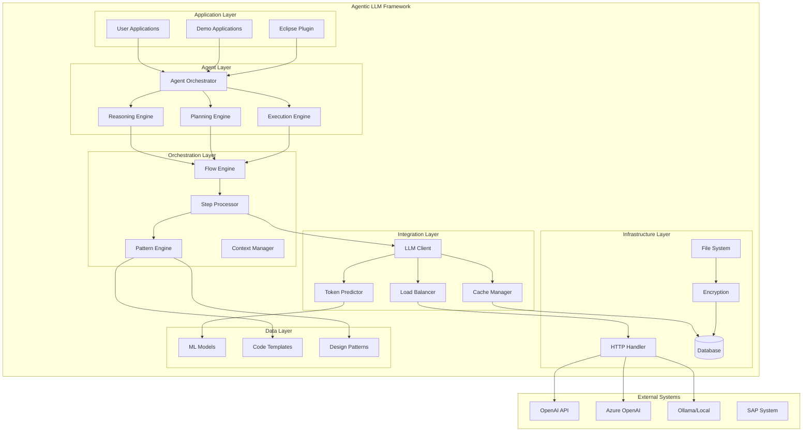
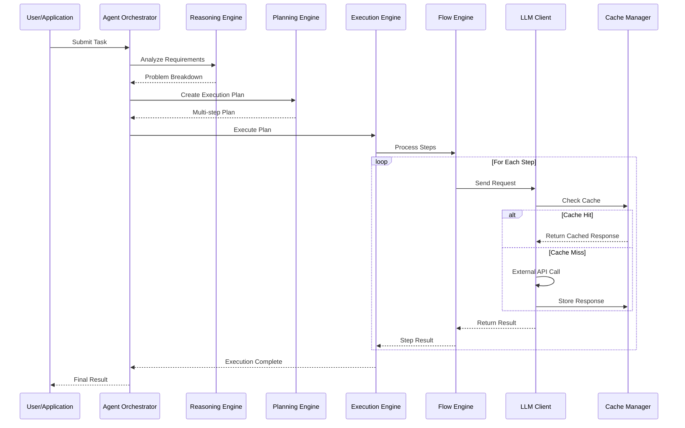
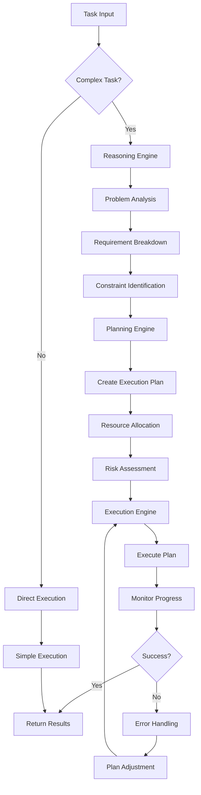

# Agentic LLM Framework Architecture

## Overview

The Agentic LLM Framework for SAP ABAP Development is designed as a multi-layered, modular system that enables intelligent AI agents to assist in ABAP development tasks. The architecture follows clean architecture principles with clear separation of concerns and extensible design patterns.

## High-Level Architecture

## Core Components

### 1. Agent Layer

The agent layer implements the core agentic capabilities:

#### Agent Orchestrator (`zcl_agent_orchestrator`)
- **Purpose**: Coordinates multiple AI agents for complex tasks
- **Responsibilities**:
  - Agent lifecycle management
  - Task distribution and coordination
  - Inter-agent communication
  - Result aggregation

#### Reasoning Engine (`zcl_reasoning_engine`)
- **Purpose**: Analyzes requirements and breaks down complex problems
- **Capabilities**:
  - Problem decomposition
  - Dependency analysis
  - Constraint identification
  - Solution validation

#### Planning Engine (`zcl_planning_engine`)
- **Purpose**: Creates execution plans for complex tasks
- **Features**:
  - Multi-step planning
  - Resource allocation
  - Risk assessment
  - Plan optimization

#### Execution Engine (`zcl_execution_engine`)
- **Purpose**: Executes planned tasks and monitors progress
- **Capabilities**:
  - Task execution
  - Progress monitoring
  - Error handling
  - Rollback mechanisms

### 2. Orchestration Layer

#### Flow Engine (`zcl_llm_00_flow_lazy`)
- **Purpose**: Manages complex multi-step workflows
- **Features**:
  - Sequential and parallel execution
  - Conditional branching
  - Error recovery
  - Result aggregation

#### Step Processor (`zcl_llm_00_step_lazy`)
- **Purpose**: Processes individual workflow steps
- **Capabilities**:
  - Step validation
  - Input/output transformation
  - Progress tracking
  - Error handling

#### Pattern Engine (`zcl_llm_00_pat`)
- **Purpose**: Manages code templates and patterns
- **Features**:
  - Template rendering
  - Dynamic content injection
  - Pattern matching
  - Code generation

#### Context Manager (`zcl_context_manager`)
- **Purpose**: Maintains context across agent interactions
- **Capabilities**:
  - Context persistence
  - State management
  - Memory management
  - Context sharing

### 3. Integration Layer

#### LLM Client (`zcl_llm_00_llm_lazy`)
- **Purpose**: Handles communication with LLM providers
- **Features**:
  - Multi-provider support
  - Request/response handling
  - Error management
  - Rate limiting

#### Load Balancer (`zcl_llm_00_llm_lazy_balancer`)
- **Purpose**: Distributes requests across multiple LLM instances
- **Capabilities**:
  - Load distribution
  - Health monitoring
  - Failover handling
  - Performance optimization

#### Cache Manager (`zcl_llm_00_cache`)
- **Purpose**: Caches LLM responses for performance
- **Features**:
  - Response caching
  - Cache invalidation
  - Memory management
  - Performance metrics

#### Token Predictor (`zcl_llm_00_predictoken`)
- **Purpose**: Predicts token usage for cost optimization
- **Capabilities**:
  - ML-based prediction
  - Cost estimation
  - Usage optimization
  - Budget management

## Data Flow

### 1. Request Processing Flow

### 2. Agentic Decision Making

## Design Patterns

The framework implements several design patterns to ensure maintainability and extensibility:

### 1. Factory Pattern
- **Implementation**: `zcl_llm_factory`
- **Purpose**: Creates appropriate LLM client instances
- **Benefits**: Encapsulates object creation logic

### 2. Strategy Pattern
- **Implementation**: `zcl_llm_strategy`
- **Purpose**: Allows switching between different LLM providers
- **Benefits**: Runtime algorithm selection

### 3. Observer Pattern
- **Implementation**: `zcl_agent_observer`
- **Purpose**: Notifies interested components of agent state changes
- **Benefits**: Loose coupling between components

### 4. Command Pattern
- **Implementation**: `zcl_agent_command`
- **Purpose**: Encapsulates agent actions as objects
- **Benefits**: Undo/redo capabilities, queuing

### 5. Template Method Pattern
- **Implementation**: `zcl_agent_template`
- **Purpose**: Defines skeleton of agent algorithms
- **Benefits**: Code reuse, consistent behavior

## Security Architecture

### 1. Authentication & Authorization
- API key encryption using `zcl_llm_00_codec`
- Role-based access control
- Session management
- Audit logging

### 2. Data Protection
- Input validation and sanitization
- Output encoding
- Secure communication (HTTPS)
- Data encryption at rest

### 3. Rate Limiting
- Request throttling per API key
- Token-based rate limiting
- Automatic backoff strategies
- Abuse prevention

## Performance Considerations

### 1. Caching Strategy
- Multi-level caching (memory, database)
- Cache invalidation policies
- Cache warming strategies
- Performance monitoring

### 2. Load Balancing
- Round-robin distribution
- Health-based routing
- Failover mechanisms
- Performance metrics

### 3. Token Optimization
- ML-based token prediction
- Cost-aware model selection
- Response compression
- Batch processing

## Extensibility

### 1. Plugin Architecture
- Modular component design
- Interface-based contracts
- Configuration-driven behavior
- Hot-swappable components

### 2. Custom Agents
- Agent interface implementation
- Custom reasoning strategies
- Domain-specific planning
- Specialized execution logic

### 3. New LLM Providers
- Provider interface implementation
- Request/response adapters
- Authentication mechanisms
- Error handling strategies

## Monitoring & Observability

### 1. Metrics Collection
- Request/response times
- Token usage statistics
- Error rates and types
- Cache hit ratios

### 2. Logging
- Structured logging
- Log levels and filtering
- Log aggregation
- Performance tracing

### 3. Health Checks
- Component health monitoring
- Dependency status
- Resource utilization
- Alert mechanisms

## Future Enhancements

### 1. Advanced Agentic Features
- Multi-agent collaboration
- Learning and adaptation
- Goal-oriented planning
- Autonomous decision making

### 2. Enhanced Integration
- CI/CD pipeline integration
- Code review automation
- Testing assistance
- Documentation generation

### 3. Performance Improvements
- Async processing
- Distributed execution
- Advanced caching
- Resource optimization

This architecture provides a solid foundation for building intelligent, agentic systems that can significantly enhance SAP ABAP development productivity while maintaining security, performance, and extensibility. 